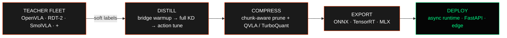

<p align="center">
  
</p>

<h3 align="center">PROVENANCE-ENFORCED VLA DISTILLATION · COMPRESSION · RUNTIME EXPORT</h3>

<p align="center">
  <a href="#quickstart"><b>Quickstart</b></a> ·
  <a href="#how-it-works"><b>How it works</b></a> ·
  <a href="#student-variants"><b>Students</b></a> ·
  <a href="#cli-tour"><b>CLI</b></a> ·
  <a href="#evaluation"><b>Evaluation</b></a> ·
  <a href="https://github.com/RobotFlow-Labs/anima-forge-distillation-pipeline/blob/main/docs/README.md"><b>Docs</b></a>
</p>

<p align="center">
  
  
  
  <a href="https://github.com/RobotFlow-Labs/anima-forge-distillation-pipeline/actions/workflows/ci.yaml"></a>
  
</p>

---

Large VLA teachers can control robots, but their memory and latency requirements often
exceed edge deployment budgets.

**FORGE provides a measured path through that problem.** It generates provenance-tracked
labels from registered teachers, trains defined student variants, compresses them, and
validates runtime exports through one CLI. Performance claims remain unpublished until
their real-data artifacts pass the launch gates below.



## Why FORGE

| | |
|---|---|
| **Multi-teacher distillation** | Ensemble any registered teachers; a learned router weights them per-sample, with confidence-aware routing, diversity and consistency losses |
| **Modern action heads** | Diffusion, flow matching, and chunked action prediction — plus consistency distillation that collapses inference to a single step |
| **Compression that respects control** | Chunk-aware layer pruning and action-centric quantization (QVLA, TurboQuant-MSE, PolarQuant) protect temporal coherence, not just accuracy |
| **Runtime export paths** | ONNX, TensorRT engines, MLX for Apple Silicon, FastAPI serving, and an async engine with action-chunk buffering |
| **Training that manages itself** | Curriculum learning, plateau-adaptive LR, hard-example mining, teacher dropout, Optuna auto-hyperparameter search |
| **Agent-native by design** | Automation-facing status and artifact commands provide strict `--json`; `forge top` returns a full machine-readable system snapshot |

Part of the **ANIMA** robotics stack by [RobotFlow Labs](https://robotflow-labs.github.io).

## Quickstart

The one-line Linux/macOS installer sets up an isolated FORGE tool, selects the CPU or
CUDA backend, and puts `forge` on `PATH`:

```bash
curl -fsSL https://raw.githubusercontent.com/RobotFlow-Labs/anima-forge-distillation-pipeline/main/install.sh | sh
```

Use `--cpu` or `--cuda` to force the Torch backend. The CPU path resolves official
PyTorch CPU wheels while still installing FORGE's complete mandatory runtime set.

For a manual environment or an exact version pin, use the package path below.

```bash
# install (Python 3.12, NVIDIA GPU recommended)
pip install anima-forge

# is this machine ready? (GPU, models, disk)
forge doctor

# fetch the nano stack + real sample labels, then distill for 200 steps
forge quickstart --yes
```

If you need an unreleased checkout instead of the public PyPI package, install the wheel built
from this repository and pass a real local label directory. See the fully copy-pasteable
[`docs/QUICKSTART.md`](https://github.com/RobotFlow-Labs/anima-forge-distillation-pipeline/blob/main/docs/QUICKSTART.md)
path and its publication status note.

## How it works

| Stage | What happens | Key tech |
|-------|--------------|----------|
| **1 · Teacher labels** | Teachers run over demonstrations; soft labels stored as HDF5 | auto-discovering teacher registry, adapter pattern |
| **2 · Distillation** | 3-phase KD: bridge warmup → full KD → action fine-tune | multi-teacher routing, curriculum, hard-example mining |
| **3 · Compression** | Layer pruning + mixed-precision quantization | Shallow-Pi, QVLA, TurboQuant, chunk-aware importance |
| **4 · Export** | Runtime conversion + validation + benchmark | torch dynamo ONNX, TensorRT INT8/FP16, MLX |

Launch-week validation is running on four NVIDIA L4 GPUs. The corrected SigLIP2
preprocessing audit invalidated the first small/medium comparison runs, so no launch
measurement is published until the four variants are retrained and their artifact
matrices pass again. Historical tuning results remain clearly labelled in the
hyperparameter guide.

| Completed variant | Real training loss reduction | Packed INT4 | ONNX CUDA | TensorRT fp16 |
|---|---:|---:|---:|---:|

Rows will appear only after corrected real-data training, compression, runtime execution,
and provenance checks complete. FORGE does not publish projections as measurements.

## Student variants

One architecture, four sizes — **frozen SigLIP2-SO400M → Bridge Attention → LoRA'd LLM
backbone → action head**. AutoSense reads model configs and wires dimensions for you.

| Variant | Backbone | Backbone params | Intended role |
|---------|----------|----------------:|---------------|
| `micro` | SmolLM2-135M | 0.135B | smallest development/edge student |
| `nano` *(default)* | Qwen3-0.6B | 0.6B | default edge student |
| `small` | Qwen3-1.7B | 1.7B | larger edge/server student |
| `medium` | Qwen3-4B | 4.0B | largest canonical student |

## CLI tour

```bash
forge info                          # system + model readiness
forge teacher list                  # the teacher fleet
forge pipeline --device cuda        # end-to-end distillation
forge quantize run --method turboquant-mse --bits 4 --device cuda --json
forge benchmark list                # packaged real-world benchmark catalog
forge benchmark all --device cuda   # all suites; JSON artifacts land in benchmarks/
forge benchmark run --checkpoint outputs/checkpoints/best.pt --device cuda --json
forge hyperparam auto --trials 30 --seed 42  # reproducible Optuna search
forge eval run libero --checkpoint outputs/checkpoints/best.pt
forge serve --checkpoint outputs/checkpoints/best.pt --port 8000
forge web --port 3000               # Command Center dashboard
forge top --json                    # agent-oriented status snapshot
```

Full reference:
[`docs/CLI_REFERENCE.md`](https://github.com/RobotFlow-Labs/anima-forge-distillation-pipeline/blob/main/docs/CLI_REFERENCE.md)

## Evaluation

FORGE ships a VLA evaluation harness: it serves your student over WebSocket/msgpack and
drives standard benchmarks in Docker — LIBERO, SimplerEnv, VLABench.

```bash
forge eval setup                    # pull benchmark images (one-time)
forge eval run-all --checkpoint outputs/checkpoints/best.pt --variant nano
forge eval compare --a v1.pt --b v2.pt
```

## Architecture

```text
src/forge/
├── teachers/         teacher adapters + auto-discovering registry
├── student.py        SigLIP → Bridge Attention → LoRA backbone → action head
├── modules/          bridge attention · diffusion/flow/chunk heads · LoRA
├── distill.py        3-phase KD loop        trainer.py     production trainer
├── multi_teacher.py  learned routing        curriculum.py  adaptive training
├── prune*.py         chunk-aware pruning    quantize/      QVLA · TurboQuant · PolarQuant
├── export/           ONNX · TensorRT · MLX  runtime/       asynchronous action engine
├── eval/             VLA benchmark harness  serve.py       FastAPI endpoint
└── web/              Command Center dashboard + JSON API
```

Deep dive:
[`docs/ARCHITECTURE.md`](https://github.com/RobotFlow-Labs/anima-forge-distillation-pipeline/blob/main/docs/ARCHITECTURE.md)

## Documentation

| Doc | Contents |
|-----|----------|
| [docs/README.md](https://github.com/RobotFlow-Labs/anima-forge-distillation-pipeline/blob/main/docs/README.md) | Overview + quick start |
| [docs/QUICKSTART.md](https://github.com/RobotFlow-Labs/anima-forge-distillation-pipeline/blob/main/docs/QUICKSTART.md) | Real-label first distillation |
| [docs/TROUBLESHOOTING.md](https://github.com/RobotFlow-Labs/anima-forge-distillation-pipeline/blob/main/docs/TROUBLESHOOTING.md) | Common failures and exact fixes |
| [docs/PIPELINE.md](https://github.com/RobotFlow-Labs/anima-forge-distillation-pipeline/blob/main/docs/PIPELINE.md) | 4-stage pipeline walkthrough |
| [docs/CLI_REFERENCE.md](https://github.com/RobotFlow-Labs/anima-forge-distillation-pipeline/blob/main/docs/CLI_REFERENCE.md) | Every command |
| [docs/CONFIGURATION.md](https://github.com/RobotFlow-Labs/anima-forge-distillation-pipeline/blob/main/docs/CONFIGURATION.md) | YAML + `FORGE_*` env vars |
| [docs/EVALUATION.md](https://github.com/RobotFlow-Labs/anima-forge-distillation-pipeline/blob/main/docs/EVALUATION.md) | VLA benchmark guide |
| [docs/DEPLOYMENT.md](https://github.com/RobotFlow-Labs/anima-forge-distillation-pipeline/blob/main/docs/DEPLOYMENT.md) | Edge deployment |
| [docs/HYPERPARAMETER_GUIDE.md](https://github.com/RobotFlow-Labs/anima-forge-distillation-pipeline/blob/main/docs/HYPERPARAMETER_GUIDE.md) | Auto-HP (Optuna) + tuning |

## Development

```bash
uv run ruff check src/ scripts/ tests/
uv run ruff format --check src/ scripts/ tests/
uv run mypy src/forge/ scripts/
uv run pytest tests/ -m "not gpu"
```

PRs target `develop`; `main` is release-only. Public usage and architecture documentation
live in
[`docs/`](https://github.com/RobotFlow-Labs/anima-forge-distillation-pipeline/blob/main/docs/README.md).

## License

Apache-2.0 © [RobotFlow Labs](https://robotflow-labs.github.io) / AIFLOW LABS
